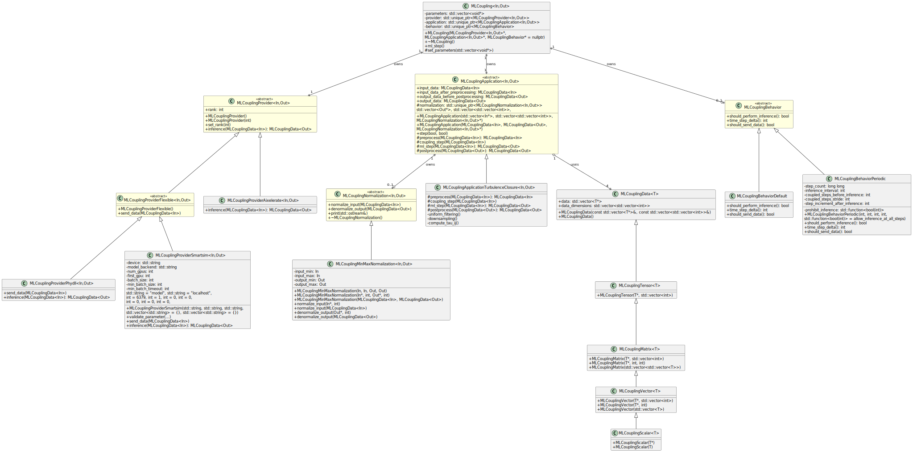

## Requirements

CMake
C++ compiler supporting C++17
Python 3.x
    clang 16.0.6
Clang 16.x

## Installation

The python dependencies can be installed via pip:

```bash
pip install -r requirements.txt
```

`./build.sh` also runs registry parser regression tests automatically.

## Test Usage

The CMakeLists.txt file includes two targets, one to actually compile a `libcpp_ml_interface_library.so` file, and another to create an executable `cpp_ml_interface_executable` that primarily acts as a first line of verification for the library. You can execute it and provide parameters, including a config file to check if it can be parsed and the subsequent `MLCoupling` object can be created successfully. Additionally, you can specify a number of steps for which the behavior class executes essentially a dummy loop to see when coupling and inference calls will be made.

**Example**:
```bash
./build.sh
./build/cpp_ml_interface_executable --config-file example.config.toml --behavior 100
```

`build.sh` actually does two builds, one normal and one with -O3 optimizations, which are placed in `build/` and `build_release/` respectively.


## Including in Your Own Project

WIP

these are untested notes:


```cmake
set(CPPML_DIR "${CMAKE_CURRENT_SOURCE_DIR}/../../CPP-ML-Interface")
add_subdirectory("${CPPML_DIR}" "${CMAKE_CURRENT_BINARY_DIR}/cpp-ml-interface-build" EXCLUDE_FROM_ALL)


# Link against the CPP-ML-Interface headers (no .so required)
target_link_libraries(${PROJECT_NAME} PRIVATE cpp_ml_interface_headers)
```

An actually working example project: [terrain solver](https://github.com/chrisb09/terrain_solver/blob/master/solver_cpp/CMakeLists.txt)

## Diagram

