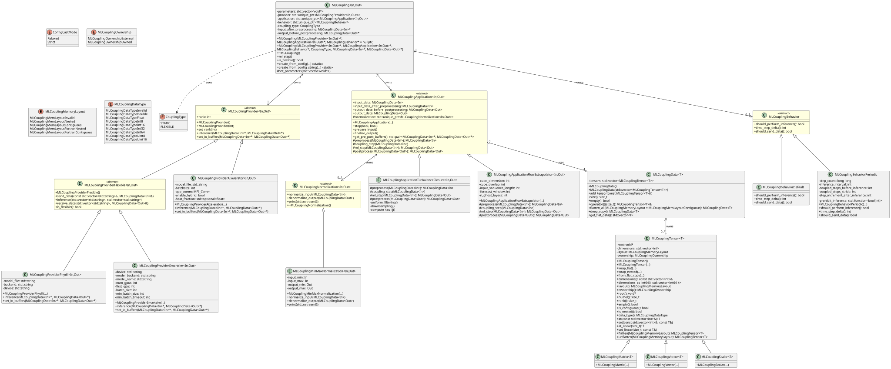

## Requirements

```
CMake
C++ compiler supporting C++17
Python 3.x
    clang 15.0.7
Clang 15.x
```

Not only do you need a python interpreter with the clang module available, you also need a version matching the clang version used to compile the library. You can specify the path to this python interpreter in your CMakeLists.txt file, we expect the CLANG to be available in the host system too, and it's path can be specified via the `LIBCLANG_PATH` environment variable, which is used by the clang python bindings to locate the clang library.

For example, if you use `module load clang` it usually sets the `EBROOTCLANG` environment variable to the root directory of the clang installation, so you can set the `LIBCLANG_PATH` like this:
```
export LIBCLANG_PATH="${EBROOTCLANG}/lib"
```

## Installation

The python dependencies can be installed via pip:

```bash
pip install -r requirements.txt
```

`./build.sh` also runs registry parser regression tests automatically.

## Test Usage

The CMakeLists.txt file includes two targets, one to actually compile a `libcpp_ml_interface_library.so` file, and another to create an executable `cpp_ml_interface_executable` that primarily acts as a first line of verification for the library. You can execute it and provide parameters, including a config file to check if it can be parsed and the subsequent `MLCoupling` object can be created successfully. Additionally, you can specify a number of steps for which the behavior class executes essentially a dummy loop to see when coupling and inference calls will be made.

**Example**:
```bash
./build.sh
./build/cpp_ml_interface_executable --config-file example.config.toml --behavior 100
```

`build.sh` actually does two builds, one normal and one with -O3 optimizations, which are placed in `build/` and `build_release/` respectively.


## Including in Your Own Project

WIP

### Simply using the library

We just need the following lines in a CMakeLists.txt file to include the library in your own project. Note that the library is header-only, so even though we can build a .so file, it is not actually required to link against it. The `cpp_ml_interface_headers` target is what you need to link against to use the library in your own project.

```cmake
# Set the path to the CPP-ML-Interface directory
set(CPP_MODULE_DIR "/path/to/CPP-ML-Interface")

add_subdirectory("${CPP_MODULE_DIR}" "${CMAKE_CURRENT_BINARY_DIR}/cpp-ml-interface-build")

# Link against the cpp_ml_interface_headers target to use the library in your own project
target_link_libraries(my_solver PRIVATE cpp_ml_interface_headers)
target_include_directories(my_solver PRIVATE "${CPP_MODULE_DIR}/include")
```

### Also using your custom subclasses

If your project defines its own subclasses of `MLCouplingProvider`, `MLCouplingNormalization`, `MLCouplingBehavior`, or `MLCouplingApplication`, you need to make sure they are registered correctly. Because C++17 does not have reflection (C++26 will have it), we let a python script that relies on clang's python bindings parse the headers of the base classes and your custom classes to generate a merged registry that includes all of them. This way, you can use your custom classes in the same way as the base classes provided by the library, and they will be correctly recognized and instantiated when specified in the config file.

The following example demonstrates how to generate a merged registry that includes both the base classes from this interface and your custom classes.

This approach is based on a working implementation.

```cmake
# Set the path to the CPP-ML-Interface directory
set(CPP_MODULE_DIR "/path/to/CPP-ML-Interface")
set(PYTHON_EXECUTABLE "/path/to/python/with/clang" CACHE FILEPATH "Python interpreter with clang module available")

# Collect all relevant headers
file(GLOB_RECURSE CPP_MODULE_HEADERS
	"${CPP_MODULE_DIR}/include/application/*.hpp"
	"${CPP_MODULE_DIR}/include/behavior/*.hpp"
	"${CPP_MODULE_DIR}/include/normalization/*.hpp"
	"${CPP_MODULE_DIR}/include/provider/*.hpp"
)
file(GLOB_RECURSE CUSTOM_HEADERS "${CMAKE_CURRENT_SOURCE_DIR}/include/*.hpp")
set(ALL_HEADERS ${CPP_MODULE_HEADERS} ${CUSTOM_HEADERS})
list(REMOVE_DUPLICATES ALL_HEADERS)

# Define paths for the generated registry
set(GENERATED_REGISTRY "${CPP_MODULE_DIR}/include/generated_registry.hpp")
set(TEMP_GENERATED_REGISTRY "${CMAKE_CURRENT_BINARY_DIR}/generated_registry.tmp.hpp")

# Set base classes and clang arguments for registry generation
set(BASE_CLASSES "MLCouplingProvider,MLCouplingNormalization,MLCouplingBehavior,MLCouplingApplication")
set(CLANG_ARGS "-std=c++17 -I${CPP_MODULE_DIR}/include -I${CMAKE_CURRENT_SOURCE_DIR}/include -xc++")

# Custom command to generate the registry
add_custom_command(
	OUTPUT "${GENERATED_REGISTRY}"
	COMMAND ${CMAKE_COMMAND} -E env "CLANG_ARGS=${CLANG_ARGS}"
			"${PYTHON_EXECUTABLE}" "${CPP_MODULE_DIR}/scripts/generate_registry.py"
			"${TEMP_GENERATED_REGISTRY}" "${BASE_CLASSES}" ${ALL_HEADERS}
	COMMAND ${CMAKE_COMMAND} -E copy_if_different "${TEMP_GENERATED_REGISTRY}" "${GENERATED_REGISTRY}"
	DEPENDS ${ALL_HEADERS} "${CPP_MODULE_DIR}/scripts/generate_registry.py"
	WORKING_DIRECTORY "${CPP_MODULE_DIR}"
	COMMENT "Generating merged registry..."
)

add_custom_target(custom_registry DEPENDS "${GENERATED_REGISTRY}")

# Disable CPP-ML-Interface's own registry generation to avoid overwriting our merged one
set(CPPML_DISABLE_REGISTRY_GEN ON CACHE BOOL "Disable CPP-ML-Interface registry generation" FORCE)
add_subdirectory("${CPP_MODULE_DIR}" "${CMAKE_CURRENT_BINARY_DIR}/cpp-ml-interface-build")

# Add your executable
add_executable(my_solver main.cpp)
add_dependencies(my_solver custom_registry)

# Link against the interface library and ensure it depends on the custom registry
target_link_libraries(my_solver PRIVATE cpp_ml_interface_headers cpp_ml_interface_library)
add_dependencies(cpp_ml_interface_library custom_registry)

# Add include directories for your project and the interface targets
target_include_directories(my_solver PRIVATE "${CMAKE_CURRENT_SOURCE_DIR}/include")
target_include_directories(cpp_ml_interface_library PRIVATE "${CMAKE_CURRENT_SOURCE_DIR}/include")
target_include_directories(cpp_ml_interface_executable PRIVATE "${CMAKE_CURRENT_SOURCE_DIR}/include")
```

An actually working example project can be found in the [`module_test`](https://github.com/chrisb09/smartsim_playground/tree/master/module_test) directory of the `smartsim_playground` repository, which includes a custom provider and behavior, and demonstrates how to set up the CMakeLists.txt file to generate the merged registry and use the library in a project with custom subclasses.

## Score-P Profiling Instrumentation

The library includes optional **manual Score-P instrumentation** that can be enabled at build time. When active, it produces CUBE4 profiles (`.cubex` files) viewable in `cube4` or `Vampir`, giving a per-phase breakdown of the ML coupling overhead.

### Prerequisites

- **Score-P 8.4** (built against `gompi/2022a`: GCC 11.3 + OpenMPI 4.1.4)
- **PAPI 7.0.0** (optional, for hardware counter metrics)

The cluster environment script [set_env_claix23_cuda12.4.sh](set_env_claix23_cuda12.4.sh) loads these modules automatically when `USE_SCOREP=1` is exported before sourcing it:

```bash
export USE_SCOREP=1
source set_env_claix23_cuda12.4.sh
```

> **Note:** Do not set `SCOREP_METRIC_PAPI` to hardware counter events (e.g. `PAPI_TOT_INS`) on standard compute nodes — `perf_event_paranoid` restrictions will cause a fatal PAPI initialization crash. Keep it empty:
> ```bash
> export SCOREP_METRIC_PAPI=""
> ```

### Enabling in CMake

Pass `-DWITH_SCOREP=ON` to the CMake configure step. This activates the `USE_SCOREP` compile definition throughout the library and switches the compiler to the `scorep-mpicxx` wrapper:

```bash
cmake -B build -DWITH_SCOREP=ON
cmake --build build
```

Or via the build script:

```bash
USE_SCOREP=1 ./build.sh
```

### Instrumented Regions

When built with `WITH_SCOREP=ON`, the following `SCOREP_USER_REGION` regions are available in the profiles:

| Region | Location | Description |
|--------|----------|-------------|
| `cppml_prepare_input` | `ml_coupling.hpp` | Input data preparation before inference |
| `cppml_static_inference` | `ml_coupling.hpp` | Provider dispatch + inference call |
| `cppml_finalize_output` | `ml_coupling.hpp` | Output copy after inference |
| `smartsim_put_tensor` | SmartSim provider | Per-tensor `put_tensor` call to the Redis DB |
| `smartsim_run_model` | SmartSim provider | `run_model` call to the Redis DB |
| `smartsim_unpack_tensor` | SmartSim provider | Per-tensor `unpack_tensor` from the Redis DB |
| `phydll_prepack` | PhyDLL provider | Float→double cast + buffer preparation |
| `phydll_send` | PhyDLL provider | `phydll_set_field` + `phydll_send` |
| `phydll_recv` | PhyDLL provider | `phydll_recv` + `phydll_get_field` loop |
| `phydll_unpack` | PhyDLL provider | Double→float cast + output unpack |
| `aix_inference` | AIxelerator provider | Wraps the AIxeleratorService `inference()` call |

### Enabling in a Downstream Project

If your project uses `add_subdirectory` to consume this library, propagate the flag:

```cmake
set(WITH_SCOREP ON CACHE BOOL "Enable Score-P instrumentation" FORCE)
add_subdirectory("${CPP_MODULE_DIR}" "${CMAKE_CURRENT_BINARY_DIR}/cpp-ml-interface-build")
```

This ensures the library's compile definitions and Score-P wrapper flags are applied consistently across your project and the CPP-ML-Interface build.

---

## CPU Inference Strategies & Threading

The different providers supported by this interface employ varying strategies for CPU inference, which impacts how you should allocate resources in your job scripts.

| Provider | Strategy | Execution Model | Parallelism Control |
| :--- | :--- | :--- | :--- |
| **AIxelerator** | Per-rank | In-process; one model instance inside every simulation rank. | Framework-level (OpenMP/MKL) |
| **SmartSim** | Per-node | Remote; one model in an external Redis database serves many simulation ranks. | Managed by RedisAI thread pool |
| **PhyDLL** | Batched MPMD | Separate MPI ranks; one DL rank aggregates data from multiple simulation ranks into a single batch. | Explicitly configurable via environment variables |

### PhyDLL Threading Configuration

When running the PhyDLL DL clients (either the C++ `dl_client` or the Python `phydll_dl_client.py`), you can control Torch's internal parallelism using the following environment variables:

- `MLCOUPLING_INTRA_OP_THREADS`: Number of threads used for parallelizing individual operations (e.g., matrix multiplications). Defaults to `SLURM_CPUS_PER_TASK` if running under Slurm.
- `MLCOUPLING_INTER_OP_THREADS`: Number of threads used for parallelizing independent operations in the model graph.

**Best Practice**: For CPU inference with PhyDLL, it is recommended to launch fewer DL ranks than simulation ranks (e.g., one DL rank per node) and give each DL rank multiple cores via Slurm's `--cpus-per-task`. The clients will automatically respect this allocation to ensure efficient execution without oversubscribing the CPU.

## Diagram

